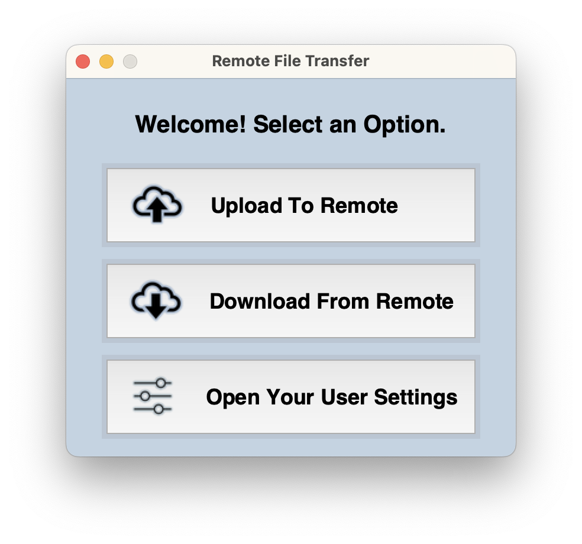
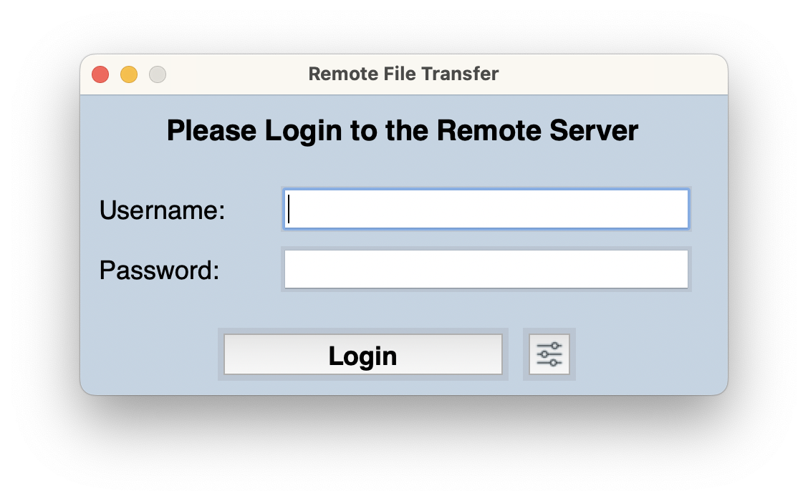
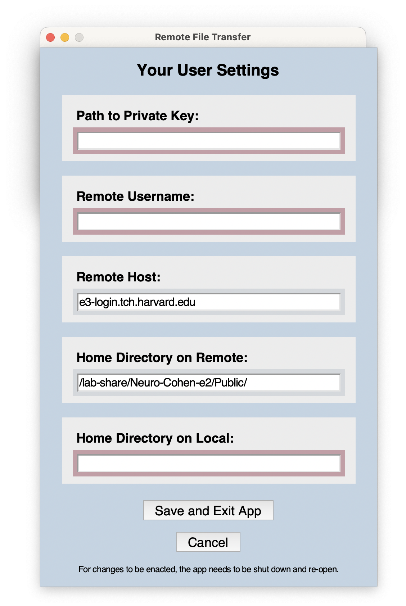
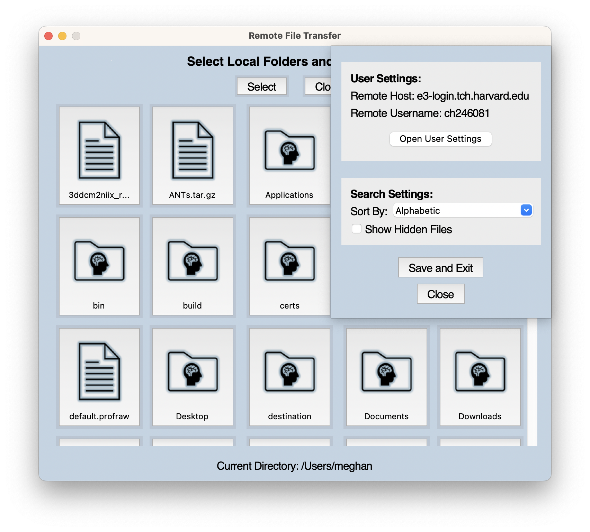
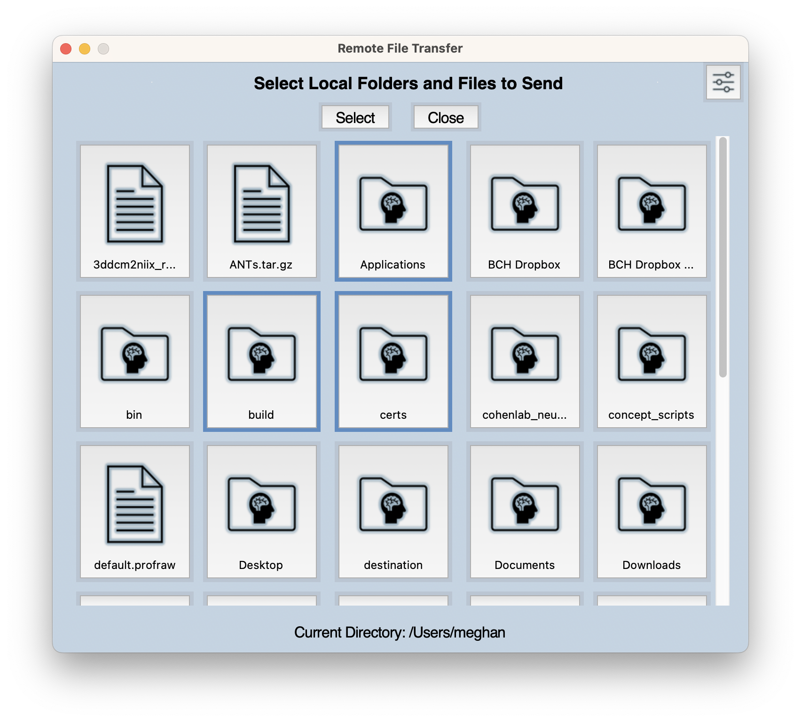
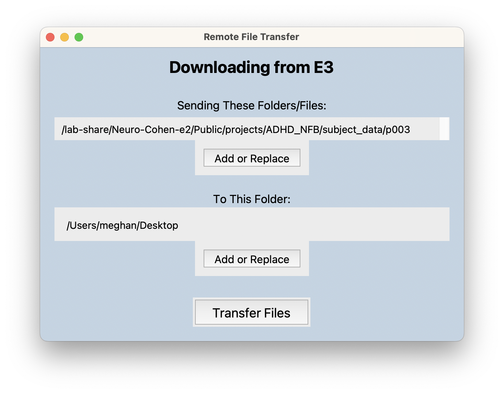
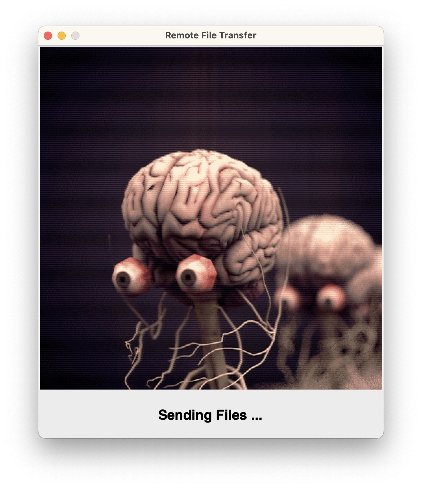

# Remote File Transfer App 

**Link To Application (.dmg file):** https://drive.google.com/file/d/1nH2JVmrCC_0j3VXG2a_y3e23hgtUhIaV/view?usp=sharing

This application transfer files to and from remote servers via a graphical user interface. It was designed to make the transfer of files to and from Boston Children's Hospital's High Performance Computing Cluster, E3, easier for those without a firm handle on command line file transfer tools like `rsync`.

The application is written fully in python, using `tkinter` for graphics and `paramiko` for transfering files. 

Users can configure their own remote server information (username, private key path, hostname) in User Settings. Users can login using either their password or a private key.

